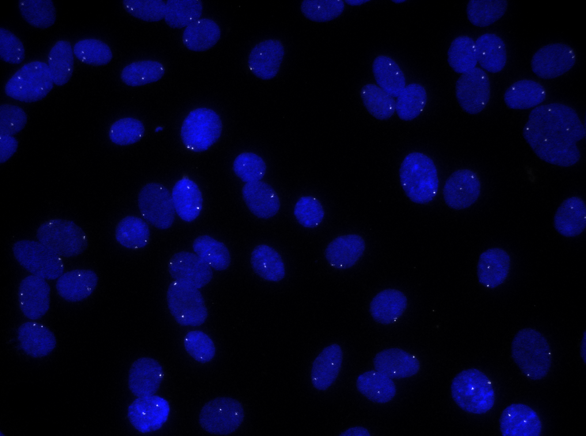
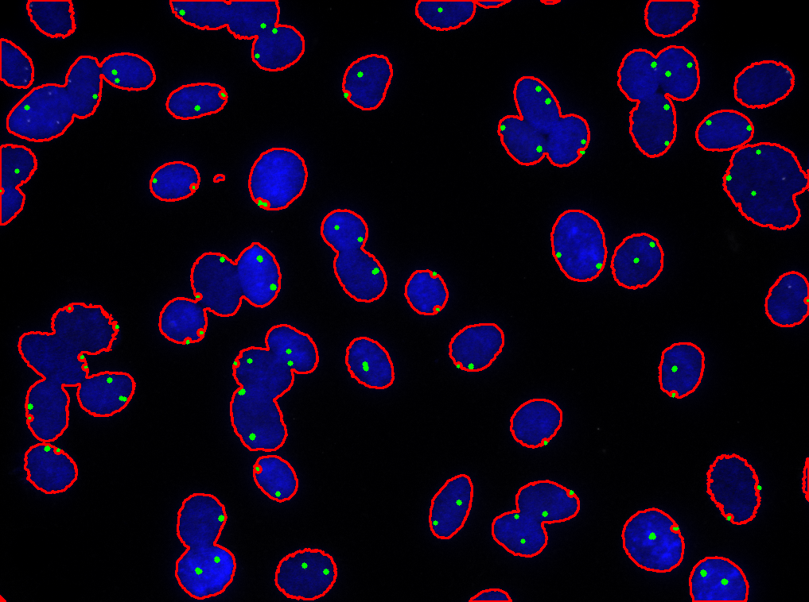

# Medical-Cell-Anomalies-Instance-Segmentation

This project demonstrates how to detect and segment anomalies in medical cell images using Python and OpenCV. The workflow includes reading a cell image, processing it to find white (anomalous) pixels, detecting blue cells, and visualizing the results by drawing boundaries and markers on the output image.

---

## Table of Contents

- [Overview](#overview)
- [Project Structure](#project-structure)
- [Requirements](#requirements)
- [Usage](#usage)
- [Results](#results)
- [Acknowledgements](#acknowledgements)

---

## Overview

The goal of this project is to automate the detection of cell anomalies in microscopy images. The process involves:

- Reading the input cell image (`Cells.png`)
- Detecting and counting white pixels (potential anomalies)
- Detecting blue cells and drawing boundaries around them
- Visualizing the results on a new output image

---

## Project Structure

```
Cells.ipynb           # Jupyter notebook with all code and explanations
Cells.png             # Input image (original cell image)
Result.png      # Output/result image (with detected anomalies and boundaries)
README.md             # Project documentation
```

---

## Requirements

- Python 3.x
- OpenCV (`cv2`)
- NumPy
- Google Colab (optional, for running in the cloud)

Install dependencies with:

```sh
pip install opencv-python numpy
```

---

## Usage

1. **Open the Notebook**

   Open `Cells.ipynb` in Jupyter Notebook or Google Colab.

2. **Set Up Environment**

   If using Google Colab, mount your Google Drive to access the images.

3. **Run the Processing Cells**

   The notebook will:
   - Load the input image (`Cells.png`)
   - Detect and count white pixels (anomalies)
   - Detect blue cells and draw boundaries
   - Save and display the result as `Cells_result.png`

4. **Check the Output**

   The processed image (`Cells_result.png`) will show:
   - Green circles on detected white pixels (anomalies)
   - Red boundaries around blue cells

---

## Results

- **Input Image:**  
  

- **Result Image:**  
  

  - Green circles indicate detected white pixels (potential anomalies).
  - Red boundaries highlight detected blue cells.
  - The total count of white pixels is printed in the notebook output.

---

## Acknowledgements

- [OpenCV](https://opencv.org/) for image processing
- [NumPy](https://numpy.org/) for numerical operations
- Google Colab for cloud-based Python execution

---

For more details, see the code and explanations in Cells.ipynb. Feel free to contribute or raise issues if you find any bugs or have suggestions for improvements.
